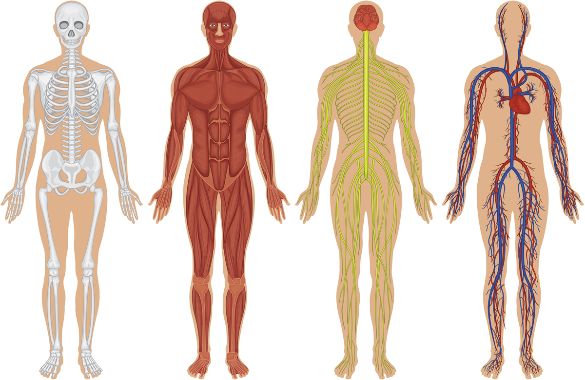
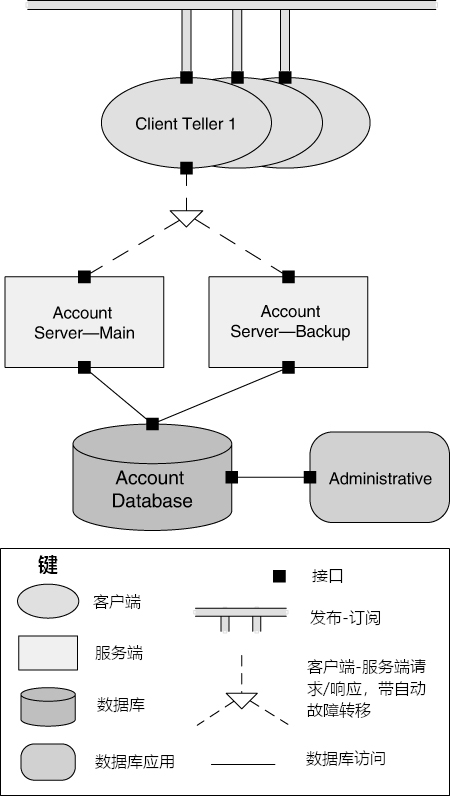
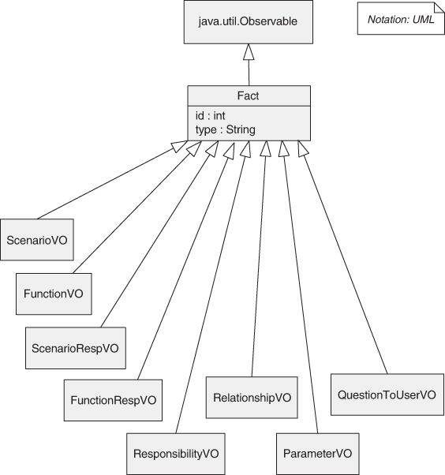

# 1. 第1章 什么是软件架构？

> 我们被叫来担任未来的架构师，而不是当它的受害者。
>
> —R. Buckminster Fuller 

之所以撰写（就我们而言）和阅读（你对来说）一本关于软件架构（它浓缩了许多人的经验）的书，是因为我们认为

1. 拥有合理的软件架构对于软件系统开发的成功非常重要，并且

2. 关于软件架构的知识体系足以写满一本书。

曾经有一段时间，这两种假设都有待证明。本书的早期版本试图让读者相信这两个假设都是正确的，在你被说服之后，为你提供基础知识，以便你可以自行应用架构实践。今天，关于这两个目标似乎没有什么争议，所以这本书更多的是关于提供指导而不是说服读者。

软件架构的基本原则是，每个软件系统都是为了满足组织的业务目标而构建的，并且系统的架构是这些（通常是抽象的）业务目标与最终（具体）系统之间的桥梁。虽然从抽象目标到具体系统的过程可能很复杂，但好消息是，可以使用已知技术来设计、分析和记录软件架构，以支持实现这些业务目标。复杂性可以被驯服，变得易于处理。

这些就是本书的主题：设计、分析和记录架构。我们还将研究这些活动的影响因素，主要是以导致质量属性需求的业务目标。

在本章中，我们将严格从软件*工程*的角度关注架构。也就是说，我们将探索软件架构为开发项目带来的价值。后面的章节将从业务和组织的角度进行讨论。

## 1.1. 软件架构是什么和不是什么

可以从网上轻松找到许多软件架构的定义，但我们喜欢这个：

> 系统的软件架构是推理系统所需的一组结构。这些结构包括：软件元素、它们之间的关系以及两者的属性。

这个定义与其他谈论系统“早期”、“重大”或“重要”决策的定义形成鲜明对比。虽然许多架构决策确实是在早期做出的，但并非所有决策都是，尤其是在敏捷（Agile）和螺旋式开发项目中。同样，有许多早期做出的决策并不是我们所认为的架构。此外，很难看到一个决定并判断它是否“主要的”。有时只有时间会证明一切。由于决定架构是架构师最重要的职责之一，我们需要知道架构由哪些决策组成。

相比之下，结构在软件中很容易识别，它们构成了系统设计和分析的强大工具。

所以，定义就变成这样：架构是关于让人推理的结构。

让我们看一下我们的定义的一些含义。

### 架构是一组软件结构的集合

这是我们定义的第一个也是最明显的含义。结构只是一组由关系结合在一起的元素。软件系统由许多结构组成，没有一个结构可以声称其是*架构*。结构可以分组到不同的类别中，而类别本身则提供了思考架构的有用方法。架构性的结构（architectural structure）可以分为三个有用的类别，它们将在架构的设计、文档和分析中发挥重要作用：

1. 组件和连接结构

2. 模块结构

3. 分配结构

我们将在下一节中深入探讨这些类型的结构。

尽管软件包含无数的结构，但并非所有结构都是架构性的。例如，把包含字母“z”的源代码行集，按长度从短到长递增排序，也是一种软件结构。但这既不有趣，也不关乎架构。如果结构能够帮助你推理系统和系统属性，那么该结构就是架构性的。推理应该是与（对某些利益相关者很重要的）系统属性相关。这些属性包括系统实现的功能、系统在面对缺陷或试图将其关闭时保持有效运行的能力、对系统进行特定更改的难易程度、系统对用户请求的响应能力等等。在本书中，我们将花费大量时间探索架构与诸如此类的*质量属性（quality attributes）*之间的关系。

因此，架构的集合既不固定也没限制。什么是架构取决于在你的系统上下文中哪些有助于推理（reason）系统。

### 架构是一种抽象

由于架构由结构组成，而结构由元素[^1]和关系组成，因此架构由软件元素以及这些元素的关系组成。这意味着架构明确而刻意地省略了有关元素的某些信息，这些信息对系统推理没有用。因此，架构首先是系统的“抽象”，它选择某些细节并掩盖了其他细节。在所有现代系统中，元素通过接口来交互的，这些接口将有关元素的详细信息划分为公共部分和私有部分。架构关注的是这个部分的公共方面；元素的私有细节（仅与内部实现有关的细节）不是架构上的。这种抽象对于驾驭架构的复杂性至关重要：我们根本无法也不想一直处理所有的复杂性。我们希望（且需要）让理解系统架构比理解该系统的每个细节容易许多。即使是适度的规模的系统，你不能把一个系统的每一个细节都记在脑海里；架构的意义在于让你不必这样做。

### 架构和设计

架构是设计，但并非所有设计都是架构。也就是说，许多设计决策不受架构的约束（毕竟架构是一种抽象），并且取决于下游设计者或实现者的审慎和良好的判断力。

### 每个软件系统都有软件架构

每个系统都有一个架构，因为每个系统都有元素和关系。但是，这并不意味着任何人都知道该架构。也许所有设计系统的人都早已不在了，文档已经遗失了（或从未产生过），源代码已经丢失（或从未交付过），我们手头只有可执行的二进制码。这揭示了系统的架构与该架构的*表现（representation）*之间的差异。鉴于架构可以独立于其描述或规范而存在，这就提出了 [第 22 章][ch22] 中描述的*架构文档*的重要性。

### 不是所有的架构都是好的

我们的定义无关于系统的架构是好的还是坏的。架构可能有助或妨碍实现系统的重要需求。如果我们不接受试错作为为系统选择架构的最佳方式（也就是说，随机选择一个架构以其构建系统，并不断改进以期最后得到最好的结果），那么[第20章][ch20]*架构设计* 和[第21章][ch21] *架构评估* 就显示出其重要性了。

### 架构包含行为

每个元素的行为都是架构的一部分，因为该行为可以帮助你推理系统。元素的行为体现了它们如何相互交互以及与环境交互。这显然是我们架构定义的一部分，并且会影响系统所展示的属性，例如其运行时的性能。

行为的某些方面超出了架构师的关注范围。但是，如果元素的行为会影响整个系统的可接受性，则必须将此行为视为系统架构设计的一部分，并且应将其记录在案。

> **系统和企业架构**
>
> 系统架构和企业架构是与软件架构相关的两个学科。这两个学科都比软件关注的更广泛，并通过建立软件系统及其架构师必须遵守的约束来影响软件架构。
>
> ***系统架构***
>
> 系统的架构是系统的一种表示形式，将功能映射到硬件和软件组件上，将软件架构映射到硬件架构上，并关注人类与这些组件的交互。也就是说，系统架构关注的是硬件、软件和人的整体。
>
> 例如，系统架构将影响分配给不同处理器的功能以及连接这些处理器的网络类型。软件架构将决定该功能的结构以及驻留在各个处理器上的软件程序如何交互。
>
> 对软件架构的描述，因为它映射到硬件和网络组件，允许推理性能和可靠性等质量。对系统架构的描述将允许对功耗、重量和物理尺寸等其他质量进行推理。
>
> 在设计特定系统时，系统架构师和软件架构师之间经常就功能的分布进行协商，从而对软件架构施加约束。
>
> ***企业架构***
>
> 企业架构是对组织流程、信息流、人员和组织子单位的结构和行为的描述。企业架构不需要包括计算机化的信息系统——显然，在计算机出现之前，组织拥有符合上述定义的架构——但如今，如果没有信息系统的支持，除了最小的企业之外，所有企业的企业架构都是不可想象的。因此，现代企业架构关注的是软件系统如何支持企业的业务流程和目标。这组关注点中通常包括一个过程，用于决定企业应支持哪些系统具有哪些功能。
>
> 例如，企业架构将指定各种系统用于交互的数据模型。它还将指定企业系统如何与外部系统交互的规则。
>
> 软件只是企业架构的一个关注点。人类如何使用软件来执行业务流程以及确定计算环境的标准是企业架构解决的另外两个常见问题。
>
> 有时，支持系统之间以及与外部世界通信的软件基础架构被认为是企业架构的一部分；在其他时候，此基础结构被视为企业中的系统之一。（无论哪种情况，该基础设施的架构都是*软件*架构！这两种观点将导致与基础设施相关的个人有不同的管理结构和影响范围。
>
> ***Are These Disciplines in Scope for This Book? Yes! (Well, No.)*** ***这些学科是否在本书的范围内？是的！（嗯，没有。）***
>
> 系统和企业为软件体系结构提供了环境和约束。软件架构必须存在于系统和企业中，并且越来越成为实现组织业务目标的重点。企业和系统架构与软件架构有很多共同之处。所有这些都可以设计、评估和记录；全部符合要求；所有这些都旨在满足利益相关者；都由结构组成，而结构又由元素和关系组成；所有人都有一套模式供各自的架构师使用；这样的例子不胜枚举。因此，就这些架构与软件架构的共同点而言，它们在本书的讨论范围内。但像所有技术学科一样，每个学科都有自己的专业词汇和技术，我们不会涵盖这些。还有很多其他来源可以这样做。

## 1.2. 架构结构和视图

由于架构结构是我们定义和处理软件架构的核心，因此本节将更深入地探讨这些概念。这些概念在[第22章][ch22]中有更深入的论述，我们将在其中讨论架构文档。

架构结构在自然界中具有对应物。例如，神经科医生、骨科医生、血液科医生和皮肤科医生对人体的各种结构都有不同的看法，如 [图1.1][ch01_fig01] 所示。眼科医生、心脏病专家和足病医生专注于特定的子系统。运动学家和精神科医生关注整个安排行为的不同方面。尽管这些视图的描绘方式不同，属性也非常不同，但所有视图本质上都是相关和相互关联的：它们共同描述了人体的结构。

 **图1.1** 生理结构

架构结构在人类的努力中也有对应物。例如，电工、水管工、供暖和空调专家、屋顶工和框架工都与建筑物中的不同结构有关。你可以很容易地看到这些结构中每个结构的重点品质。

软件也是如此。

### 三类结构

架构结构可以分为三大类，取决于它们所展现的元素的广泛性质，以及它们支持的推理类型：

1. *组件和连接器（C&C）结构（Component-and-connector (C&C) structures）* 侧重于元素在运行时相互交互以执行系统功能的方式。它们描述了如何将系统构建为一组具有运行时行为（组件）和交互（连接器）的元素。组件是主要的计算单元，可以是服务、对等方、客户端、服务器、筛选器或许多其他类型的运行时元素。连接器是组件之间的通信工具，例如调用返回、进程同步操作、管道或其他。C&C结构有助于回答以下问题：

   - 什么是主要的执行组件，它们在运行时如何交互？

   - 主要的共享数据存储是什么？

   - 系统的哪些部分是重复的？

   - 数据如何在系统中传递？

   - 系统的哪些部分可以并行运行？

   - 系统的结构能否在执行时发生变化，如果是，如何改变？

   推而广之，这些结构对于询问有关系统运行时属性（如性能、信息安全性、可用性等）的问题至关重要。

   C&C结构是我们最常见的一类结构，但另外两类结构也很重要，不应被忽视。

   [图1.2][ch01_fig02] 使用非正式符号显示了一个系统的C&C结构的草图，该符号在图例中进行了解释。系统包含一个由服务器访问的共享存储库和一个管理组件。一组客户端柜员可以与帐户服务器交互，并使用发布-订阅连接相互通信。

   

    **图1.2** 组件和连接器结构

2. *模块结构（Module structures）* 将系统划分为实现单元，在本书中我们称之为 *模块（modules）*。模块结构显示如何将系统构造为，必须构建或获得的一组代码或数据单元。模块被分配了特定的计算职责，是编程团队工作分配的基础。在任何模块结构中，元素都是某种模块（可能是类、包、层，或者仅仅是功能划分，所有这些都是实现单元）。模块代表了以静态方式考虑系统。模块被分配了职能责任领域；在这些结构中，不太强调生成的软件在运行时的行为。模块实现包括包、类和层。模块结构中模块之间的关系包括使用（uses）、泛化（generalization ）（或“is-a”）和“是xx的一部分（is part of）”。[图1.3][ch01_fig03] 和 [图1.4][ch01_fig04] 分别显示了使用统一建模语言 （UML） 表示的模块元素和关系的示例。

   

    **图 1.3** UML 中的模块元素

   

    **图 1.4** UML 中的模块关系

   模块结构允许我们回答以下问题：

   - 分配给每个模块的主要功能职责是什么？

   - 模块还允许使用哪些其他软件元素？

   - 它实际使用和依赖哪些其他的软件？

   - 哪些模块通过泛化（generalization ）或特化（specialization ）（即继承）关系与其他模块相关？

   模块结构直接传达此信息，它们也可用于回答“有关分配给每个模块的职责发生变化时对系统的影响”的问题。因此，模块结构是推理系统可修改性的主要工具。

3. *分配结构（Allocation structures）* 建立从软件结构到系统非软件结构（如其组织或其开发、测试和执行环境）的映射。分配结构回答了以下问题：

   - 每个软件元素在哪个处理器上执行？
   
   - 在开发、测试和系统构建过程中，每个元素存储在哪些目录或文件中？
   
   - 每个软件元素分配给那些开发团队？

### 一些有用的模块结构

有用的模块结构包括：

- *分解结构（Decomposition structure）*。 这些单元是通过“是xx的一个子模块（is-a-submodule-of）”关系相互关联的模块，这种结构显示模块如何递归分解为较小的、直到模块足够小以易于理解的模块。此结构中的模块代表设计的起点，因为架构师列举软件单元必须执行的操作，并将每个项目分配给模块以进行后续（更详细）设计和最终实现。模块通常具有与其关联的产品（例如接口规范、代码和测试计划）。分解结构在很大程度上决定了系统的可修改性。也就是说，更改是否属于几个（最好很少）模块的范围？此结构通常用作开发项目组织架构的基础，包括文档结构以及项目的集成和测试计划。[图1.5][ch01_fig05] 显示了分解结构的示例。

  

   **图1.5** 分解结构

- *uses 结构（Uses structure）*。 在这个重要但经常被忽视的结构中，单元是模块，也可能是类。这些单元通过 *uses* 关系（一种特殊的依赖形式）相关联。如果第一个软件单元的正确性依赖第二个软件单元的正常运行（而不是桩），则第一个软件单元uses 第二个软件单元。uses 结构用于设计可以扩展以添加功能，或者可以从中提取有用的功能子集的系统。轻松创建系统子集的能力允许增量开发。这种结构也是衡量社交债务的基础——团队之间实际发生的沟通量，而不仅仅是应该发生的沟通量——因为它定义了哪些团队应该相互沟通。[图1.6][ch01_fig06] 显示了一个 uses 结构，并突出显示了如果模块 admin.client 存在，则必须以增量形式存在的模块。

  

   **图1.6** 使用结构

- *分层结构*（Layer structure）。 此结构中的模块称为层。层是一个抽象的“虚拟机”，它通过托管接口提供一组有凝聚力的服务。允许层以托管方式使用其他层；在严格分层的系统中，一个层只允许使用另一个层。此结构使系统具有可移植性，即更改基础虚拟机的能力。[图1.7][ch01_fig07] 示出了UNIX系统V操作系统的分层结构。

  

   **图 1.7** 分层结构

- *类（或泛化）结构（Class (or generalization) structure）*。此结构中的模块称为类，它们通过“继承自xx（inherits-from）”或“是xx的实例（is-an-instance-of）”的关系进行关联。此视图支持对具有相似行为或功能的集合进行推理，以及参数化差异（parameterized differences）。类结构允许人们推理重用和功能的增量添加。在使用面向对象的分析和设计的项目的文档中，通常使用此结构。[图1.8][ch01_fig08] 显示了取自架构专家工具的泛化结构。

  

   **图1.8** 泛化结构

  

- *数据模型（Data model）*。数据模型根据数据实体及其关系来描述静态信息结构。例如，在银行系统中，实体通常包括帐户、客户和贷款。帐户具有多个属性，例如帐号、类型（储蓄或支票）、状态和当前余额。关系可能指示一个客户可以拥有一个或多个帐户，并且一个帐户与一个或多个客户关联。[图1.9][ch01_fig09] 是一个数据模型的示例。

 **图1.9** 数据模型

### 一些有用的（C&C）结构

C&C 结构显示系统的运行时视图。在这些结构中，刚才描述的模块都已编译为可执行形式。因此，所有C&C结构都与基于模块的结构正交（orthogonal ），它处理的是正在运行的系统动态方面。例如，可以将一个代码单元（模块）编译为单个服务并在执行环境中复制数千次。或者可以编译 1,000 个模块并将其链接在一起以生成单个运行时可执行文件（组件）。

所有C&C结构中的关系是 *附着（attachment）*，显示了组件和连接如何连接在一起。（连接本身可以是熟悉的构造，例如“调用”。有用的C&C结构包括：

- *服务结构（Service structure）*。此处的单元是通过服务协调机制（如消息）进行互操作的服务。服务结构是一个重要的结构，它帮助设计一个由可能彼此独立开发的组件组成的系统。

- *并发结构（Concurrency structure）*。这种C&C结构允许架构师确定并行的机会以及可能发生资源竞争的位置。单元是组件，连接是它们的通信机制。组件排列成“逻辑线程”。逻辑线程是一系列计算，可以在设计过程的后面分配给单独的物理线程。并发结构在设计过程的早期用于识别和管理与并发执行相关的问题。

### 一些有用的分配结构

分配结构定义了C&C或模块结构中的元素如何映射到非软件的事物上 - 通常是硬件（可能是虚拟化），团队和文件系统。有用的分配结构包括：

- *部署结构（Deployment structure）*。部署结构显示了如何将软件分配给硬件处理和通信元素。这里元素是软件元素（通常是C&C结构中的进程），硬件实体（处理器）和通信路径。关系是“分配到（allocated-to）”，显示软件元素驻留在哪些物理单元上，如果分配是动态的，则关系是“迁移到的（migrates-to）”。此结构可用于推理性能、数据完整性、信息安全性和可用性。它在分布式系统中特别重要，并且是实现可部署性质量属性所涉及的关键结构（参见 [第5章][ch05]）。[图1.10][ch01_fig10] 显示了 UML 中一个简单的部署结构。

  

   **图1.10** 部署结构

  

- *实现结构（implementation structure）*。此结构显示软件元素（通常是模块）如何映射到系统开发、集成、测试或配置控制环境中的文件结构。这对于管理开发活动和构建过程至关重要。

- *工作分配结构（work assignment structure）*。 此结构将实现和集成模块的责任分配给将执行这些任务的团队。将工作分配结构作为架构的一部分，可以清楚地展示，谁的工作决定具有架构和管理影响。架构师将了解每个团队所需的专业知识。例如，亚马逊决定为每个微服务指定一个团队，这是关于其工作分配结构的声明。在大型开发项目中，确定功能通用的单元并将其分配给单个团队很有用，而不是让每个需要它们的人都实现它们。这种结构还将决定团队之间的主要沟通途径：定期网络会议、维基、电子邮件列表等。

[表1.1][ch01_tab01] 总结了这些结构。它列出了每个结构中元素和关系的含义，并说明了每个结构的用途。

 **表1.1** 有用的架构性结构

|               | 软件结构 | 元素类型       | 关系                            | 适用于                                           | 影响的质量问题                       |
| :------------ | :------- | :------------- | :------------------------------ | :----------------------------------------------- | :----------------------------------- |
| **模块结构 ** | 分解     | 模块           | 是xx的子模块                    | 资源分配、项目结构和计划；封装                   | 可修改性                             |
|               | Uses     | 模块           | uses（即，需要正确存在）        | 设计子集和扩展                                   | “可子集性”，可扩展性                 |
|               | 分层     | 层             | 允许使用xx服务；提供抽象给xx    | 渐进式发展；在“虚拟机”之上实施系统               | 可移植性、可修改性                   |
|               | 类       | 类、对象       | 是xx的实例；是xx的派生          | 在面向对象的系统中，分解出共性；规划功能的扩展   | 可修改性、可扩展性                   |
|               | 数据模型 | 数据实体       | {一，多}-到{一，多}；泛化；特化 | 设计全局数据结构以实现一致性和性能               | 可修改性、性能                       |
| **C&C结构**   | 服务     | 服务，服务注册 | 附着（通过邮件传递）            | 调度分析；性能分析；鲁棒性分析                   | 互操作性、可用性、可修改性           |
|               | 并发     | 进程、线程     | 附着（通过通信和同步机制）      | 确定存在资源竞争的位置、并行性机会               | 性能                                 |
| **分配结构**  | 部署     | 组件、硬件元素 | 分配给；迁移到                  | 将软件元素映射到系统元素                         | 性能、安全性、能源、可用性、可部署性 |
|               | 实现     | 模块、文件结构 | 储存于                          | 配置控制、集成、测试活动                         | 开发效率                             |
|               | 工作分配 | 模块、组织单位 | 分配给                          | 项目管理，最佳利用专业知识和可用资源，管理共同性 | 开发效率                             |

### 将结构相互关联

这些结构中的每一个都在系统上提供不同的视角和设计句柄，并且每个结构本身都是有效和有用的。尽管这些结构给出了不同的系统视角，但它们并不是独立的。一个结构的元素将与其他结构的元素有关，我们需要对这些关系进行推理。例如，分解结构中的模块可以表现为一个C&C结构中的一个、一个中的部分或多个组件，反映了其运行时的另一面。通常，结构之间的映射是多对多的。

[图1.11][ch01_fig11] 显示了两个结构如何相互关联的一个简单示例。左图显示了一个小型客户端-服务器系统的模块分解视图。在这个系统中，必须实现两个模块：客户端软件和服务端软件。右图显示了同一系统的C&C视图。在运行时，十个客户端正在运行并访问服务端。因此，这个小系统有两个模块和十一个组件（以及十个连接器）。

 **图 1.11** 客户端-服务器系统的两个视图

虽然分解结构中的元素与客户端-服务器结构之间的对应关系是显而易见的，但这两个视图有非常不同的用途。例如，右侧视图可用于性能分析、瓶颈预测和网络流量管理，而使用左侧视图则非常困难或不可能做到这一点。（在 [第9章][ch09] 中，我们将学习map-reduce模式，其中简单、相同功能的副本分布在数百或数千个处理节点上 - 整个系统一个模块，但每个节点一个组件）。

个别项目有时以一种结构为主，并在可能的情况下根据主导结构来构造其他结构。通常，主导结构是模块分解结构，这是有充分理由的：它倾向于生成项目结构，因为它反映了开发的团队结构。在其他项目中，主导结构也可能是C&C结构，它显示了如何在运行时实现系统的功能和/或关键质量属性。

### 少即是好

并非所有系统都需要考虑许多架构结构。系统越大，这些结构之间的差异往往越大；但是对于小型系统，我们通常可以使用较少的结构。例如，通常不是使用多个C&C结构中的每一个，而是使用单个结构。如果只有一个程序，则程序结构将折叠为单个节点，无需在设计中显式表示。如果不会出现分布式（即，如果系统在单个处理器上实现），则部署结构是微不足道的，无需进一步考虑。通常，只有当设计和记录结构会带来积极的投资回报时，才应这样做，投资回报一般是在降低开发或维护成本方面。

### 选择哪种结构？

我们已经简单介绍了一些有用的架构性结构，当然还有更多其他的。架构师应该选择使用哪些结构？架构师应该选择记录哪些？当然不是全部。一个好的答案是，你应该考虑各种可用的结构如何为系统最重要的质量属性提供洞察力，然后选择最有帮助的结构。

### 架构模式

在某些情况下，架构元素的组成方式可以解决特定问题。随着时间的推移，这些组合物在许多不同的领域被发现是有用的，因此它们已被记录和传播（散播）。这些架构元素的组合为解决系统面临的一些问题提供了打包策略，称为模式。本书的 [第2部分][part02] 详细讨论了架构模式。

## 1.3. 什么造就了好的架构

没有固有的好或坏的架构。架构或多或少适用于某种目的。三层服务架构可能只是适用于大型企业基于 Web 的 B2B 系统，但却不适用于航空电子应用程序。为实现高可修改性而精心设计的架构则不适用于一次性原型（反之亦然！本书传达的信息之一是，架构实际上可以被“评估”——这是关注它们的一大好处——但这种评估只有在已确定既定目标的情况下才有意义。

尽管如此，在设计大多数架构时应遵循一些经验法则。不应用这些准则也并不意味着架构就存在致命缺陷，但它至少应该作为一个需要调查的警告信号。这些规则可以主动应用于全新开发，以帮助构建“正确的”系统。或者它们可以作为分析法（探索法）应用，以了解现有系统中的潜在问题并指导系统的发展方向。

我们将观察结果分为两类：流程建议和产品（或结构）建议。我们流程艺建议如下：

1. 软件（或系统）架构应该是单个架构师或一小群架构师的产物，并具有确定的技术领导者。此方法对于为架构的概念完整性和技术一致性非常重要。此建议适用于敏捷和开源项目以及“传统”项目。架构师和开发团队之间应该有很强的联系，以避免“象牙塔”、不切实际（不现实的）设计。

2. 架构师（或架构团队）应不断地在明确指定的质量属性要求的优先级列表之上建立架构。这些将提醒我们不断地去权衡。功能没那么重要。

3. 使用 *视图（views）* 记录架构。（视图只是一个或多个架构性结构的表示形式。这些意见应解决支持项目时间表的最重要利益相关方的关切。这可能意味着一开始文档最少，然后稍后会详细说明文档。关注点通常与系统的构建、分析和维护以及新利益相关者的教育有关。

4. 评估架构提供系统重要质量属性的能力。应该在生命周期的早期发生，此时它的回馈最大，并酌情重复，以确保对架构（或预期环境）的更改不会使设计过时。

5. 架构应当可以增量实现，以避免一次集成所有内容（这几乎永远不会起作用）并能够及早发现问题。一种方法是通过创建一个“骨架”系统，其中执行通信路径，但最初只有最少的功能。这个骨架系统可以用来增量地“增长”系统，并根据需要进行重构。

我们的结构经验法则如下：

1. 架构应具有定义明确的模块，其功能职责是根据信息隐藏和关注点分离的原则分配的。信息隐藏模块应该封装可能发生变化的内容，从而使软件免受这些更改的影响。每个模块都应该有一个定义明确的接口，该接口封装或“隐藏”使用其设施的其他软件的可变方面。这些接口应允许其各自的开发团队在很大程度上相互独立地工作。

2. 除非你的要求是前所未有的（没有先例的）——可能，但不太可能——否则你的质量属性应该通过使用特定于每个属性的众所周知的架构模式和策略（在 [第 4 章][ch04] 到 [第13章][ch13] 中描述）来实现。

3. 架构不应依赖于商业产品或工具的特定版本。如果必须，它的结构应该使更改为不同的版本既简单又便宜。

4. 生成数据的模块应与使用数据的模块分开。这往往会增加可修改性，因为更改通常仅限于数据的生产端或消费端。如果添加新数据，双方都必须更改，但分开则允许分阶段（增量）升级。

5. 不要指望模块和组件之间是一对一的对应关系。例如，在具有并发性的系统中，组件的多个实例可能并行运行，其中每个组件都是从同一模块构建的。对于具有多个并发线程的系统，每个线程可以使用来自多个组件的服务，每个组件都是从不同的模块构建的。

6. 应该使每个进程可以轻松地分配给指定的处理器，甚至可以在运行时更改。这是虚拟化和云部署趋势增长的驱动力，正如我们将在 [第16章][ch16] 和 [第17章][ch17] 中讨论的那样。

7. 该架构应具有少量简单的组件交互模式。也就是说，系统应该在整个过程中以相同的方式做同样的事情。这种做法将有助于提高可理解性、缩短开发时间、提高可靠性并增强可修改性。

8. 架构应包含一组特定的（和较小的）资源竞争区域，并且竞争解决方式已明确指定和维护。例如，如果网络利用率是一个关注领域，则架构师应为每个开发团队制定（并强制执行）准则，这些准则将导致可接受的网络流量级别。如果性能是一个问题，架构师应该制定（并强制执行）时间预算。

## 1.4. 小结

系统的软件架构是推理系统所需的一组结构。这些结构包括软件元素、它们之间的关系以及两者的属性。

有三类结构：

- 模块结构将系统展示为必须构建或获取的一组代码或数据单元。

- 组件和连接结构将系统展示为一组具有运行时行为（组件）和交互（连接）的元素。

- 分配结构显示了模块和C&C结构中的元素与非软件结构（如CPU，文件系统，网络和开发团队）的关系。

结构是架构的主要工程支点。每个结构都带来了影响一个或多个质量属性的能力。总的来说，结构代表了创建架构（以及以后分析架构并向利益相关者解释架构）的强大方法。而且，正如我们将在 [第22章][ch22] 中看到的，架构师选择作为工程支点的结构也是选择作为架构文档基础的主要基础。

每个系统都有一个软件架构，但这种架构可能会也可能不会被记录和传播。

没有固有的好或坏的架构。架构或多或少适用于某种目的。

## 1.5. 扩展阅读

如果你对软件架构作为一个研究领域非常感兴趣，你可能有兴趣阅读一些开创性的工作。其中大部分根本没有提到“软件架构”，因为这个短语是在 1990 年代中期才演变而来的，所以你必须在字里行间阅读。

Edsger Dijkstra 1968年关于T.H.E.操作系统的论文引入了层的概念[[Dijkstra 68][dijkstra_68]]。David Parnas的早期工作奠定了许多概念基础，包括信息隐藏[[Parnas 72][parnas_72]]，程序族[[Parnas 76][parnas_76]]，软件系统固有的结构[[Parnas 74][parnas_74]]，以及使用结构构建系统的子集和超集[[Parnas 79][parnas_79]]。Parnas的所有论文都可以在他的重要论文集中找到[[Hoffman 00][hoffman_00]]。现代分布式系统的存在归功于协作循环程序的概念，C. A. R. (Tony) Hoare爵士在概念和定义[[Hoare 85][hoare_85]]方面发挥了重要作用。

1972年，Dijkstra和Hoare以及Ole-Johan Dahl认为程序应该分解为独立组件，且其具有小而简单的接口。他们称他们的方法为结构化编程，但可以说这是软件架构的首次亮相[[Dijkstra 72][dijkstra_72]]。

Mary Shaw和David Garlan一起或分别完成了大量工作，帮助创建了我们称之为软件架构的研究领域。他们建立了它的一些基本原则，此外外，对开创性的架构风格家族（类似于模式的概念）进行了编列，其中一些在本章中作为架构性结构出现。从[[Garlan 95][garlan_95]]开始。

软件架构模式已在 *面向模式的软件架构* 系列[Buschmann 96等]中进行了广泛的编列。我们将在本书的 [第2部分][第02部分] 中讨论架构模式。

在工业发展项目中使用的架构视图的早期论文有[[Soni 95][soni_95]]和[[Kruchten 95][kruchten_95]]。前者发展成为一本书[[Hofmeister 00][hofmeister_00]]，全面介绍了在开发和分析中使用视图。

许多书籍都关注与架构相关的实际实现问题，例如George Fairbanks的 *Just Enough软件架构* [[Fairbanks10][fairbanks_10]]，Woods和Rozanski的 *软件系统架构* [[Woods 11][woods_11]]，以及Martin的 *Clean Architecture：A Craftsman's Guide to Software Structure and Design* [[Martin 17][martin_17]]。

## 1.6. 问题讨论

**1.** 你是否熟悉软件架构的不同定义？如果是这样，请将其与本章给出的定义进行比较和对比。许多定义包括诸如“基本原理”（说明架构之所以如此的原因）或架构将如何随时间演变等考虑因素。你是否同意或不同意这些考虑因素应该成为软件架构定义的一部分？

**2.** 讨论架构如何作为分析的基础。决策呢？架构赋予什么样的决策能力？

**3.** 架构在降低项目风险方面的作用是什么？

**4.** 找到一个普遍接受的 *系统架构* 定义，并讨论它与软件架构的共同点。对 *企业架构* 做相同的事情。

**5.** 查找已发布的软件架构示例。它展示了哪些结构？根据其目的，哪些结构 *应该* 被展示？该架构支持哪些分析？挑战它：你有什么问题是其没有回答的？

**6.** 帆船具有架构，这意味着它们具有“结构”，可以对船舶的性能和其他质量属性进行推理。查找*三桅帆船（barque）*，*双桅横帆船*，*独桅纵帆船*，*护卫舰*，*双桅帆船*，*纵帆船*和*单桅帆船*的技术定义。提出一套有用的“结构”，用于区分和推理船舶架构。

**7.** 飞机的架构可以通过解决一些主要设计问题来描述，例如发动机位置、机翼位置、起落架布局等。几十年来，大多数为客运而设计的喷气式飞机都具有以下特征：

- 安装在机翼下方的机舱中的发动机（与内置在机翼中的发动机或安装在机身后部的发动机相反）

- 在底部（而不是顶部或中间）连接机身的机翼

首先，进行在线搜索以从以下每个制造商那里找到此类设计的示例和反例：波音，巴西航空工业公司，图波列夫和庞巴迪。接下来，做一些在线研究并回答以下问题：这种设计对飞机有什么重要的品质？

------

[^1]: 在本书中，我们并不想区分模块（module）或组件（component），统一使用术语“元素（element）”代替它们。

------

[ch01_fig01]: ch01.md#ch01_fig01
[ch01_fig02]: ch01.md#ch01_fig02
[ch01_fig03]: ch01.md#ch01_fig03
[ch01_fig04]: ch01.md#ch01_fig04
[ch01_fig05]: ch01.md#ch01_fig05
[ch01_fig06]: ch01.md#ch01_fig06
[ch01_fig07]: ch01.md#ch01_fig07
[ch01_fig08]: ch01.md#ch01_fig08
[ch01_fig09]: ch01.md#ch01_fig09
[ch01_fig10]: ch01.md#ch01_fig10
[ch01_fig11]: ch01.md#ch01_fig11

[ch01_tab01]: ch01.md#ch01_tab01

[part02]: part02.md

[ch04]: ch04.md
[ch05]: ch05.md
[ch09]: ch09.md
[ch13]: ch13.md
[ch16]: ch16.md
[ch17]: ch17.md
[ch20]: ch20.md
[ch21]: ch21.md
[ch22]: ch22.md

[dijkstra_68]: ref01.md#ref_77
[dijkstra_72]: ref01.md#ref_78
[garlan_95]: ref01.md#ref_99
[hoare_85]: ref01.md#ref_112
[hoffman_00]: ref01.md#ref_113
[parnas_72]: ref01.md#ref_204
[parnas_74]: ref01.md#ref_205
[parnas_76]: ref01.md#ref_206
[parnas_79]: ref01.md#ref_207
[soni_95]: ref01.md#ref_232
[kruchten_95]: ref01.md#ref_151
[hofmeister_00]: ref01.md#ref_114
[fairbanks_10]: ref01.md#ref_85
[woods_11]: ref01.md#ref_255
[martin_17]: ref01.md#ref_174

