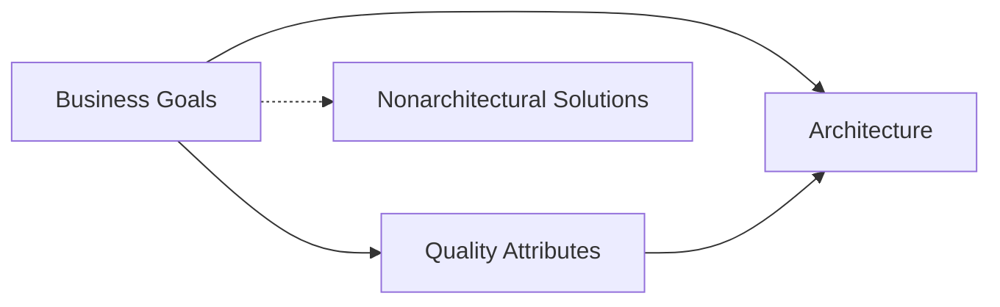

## 3 The Many Context of Software Architecture 一些软件架构的上下文

<!--https://blog.csdn.net/susemm/article/details/122770634-->

_People in London think of London as the center of the world, whereas New Yorkers think the world ends three miles outside of Manhattan._

_伦敦人认为伦敦是世界的中心，而纽约人认为世界在曼哈顿外三英里处结束。_

—Toby Young 托比·杨格

In 1976, a New Yorker magazine cover featured a cartoon by Saul Steinberg showing a New Yorker’s view of the world. You’ve probably seen it; if not, you can easily find it online. Looking to the west from 9th Avenue in Manhattan, the illustration shows 10th Avenue, then the wide Hudson River, then a thin strip of completely nondescript land called “Jersey,” followed by a somewhat thicker strip of land representing the entire rest of the United States. The mostly empty United States has a cartoon mountain or two here and there and a few cities haphazardly placed “out there,” and is flanked by featureless “Canada” on the right and “Mexico” on the left. Beyond is the Pacific Ocean, only slightly wider than the Hudson, and beyond that lie tiny amorphous shapes for Japan and China and Russia, and that’s pretty much the world from a New Yorker’s perspective.

1976年，《纽约客》杂志的封面刊登了绍尔·斯坦伯格的漫画，展示了纽约客的世界观。 您可能已经看过了； 如果没有，您可以在网上轻松找到它。 从曼哈顿的第9大道向西看，插图显示了第10大道，然后是宽阔的哈德逊河，然后是一小段完全描述不清的土地，称为“泽西岛”，其后是一条较厚的土地，代表了整个美国 状态。 大部分为空旷的美国在这里和那里到处都有一两座卡通山，还有一些城市随意地放置在“外面”，右边是无特色的“加拿大”，左边是“墨西哥”。 太平洋之外，仅比哈德逊河略宽，而太平洋之外则是日本，中国和俄罗斯的微小无定形形状，从纽约客的角度来看，这几乎就是整个世界。

In a book about architecture, it is tempting to view architecture in the same way, as the most important piece of the software universe. And in some chapters, we unapologetically will do exactly that. But in this chapter we put software architecture in its place, showing how it supports and is informed by other critical forces and activities in the various contexts in which it plays a role.

在关于架构的书中，试图以与软件领域最重要的部分相同的方式来查看架构是很诱人的。 在某些章节中，我们将毫无保留地做到这一点。 但是在本章中，我们将软件架构放到了它的位置，显示了软件架构如何在其发挥作用的各种上下文中支持其他关键力量和活动并从中获悉。

These contexts, around which we structured this book, are as follows:

我们围绕这些上下文构建了本书，内容如下：

* _Technical_. What technical role does the software architecture play in the system or systems of which it’s a part?
   _技术_。 软件架构在组成其一部分的系统中起什么技术作用？
* _Project life cycle_. How does a software architecture relate to the other phases of a software development life cycle?
   _项目生命周期_。 软件架构与软件开发生命周期的其他阶段如何相关？
* _Business_. How does the presence of a software architecture affect an organization’s business environment?
   _业务_。 软件架构的存在如何影响组织的业务环境？
* _Professional_. What is the role of a software architect in an organization or a development project?
   _专业的_。 软件架构师在组织或开发项目中的作用是什么？

These contexts all play out throughout the book, but this chapter introduces each one. Although the contexts are unchanging, the specifics for your system may change over time. One challenge for the architect is to envision what in their context might change and to adopt mechanisms to protect the system and its development if the envisioned changes come to pass.

这些内容在整本书中都有介绍，但本章将逐一介绍。 尽管上下文不变，但系统的详细信息可能会随时间而变化。 架构师面临的一项挑战是，预见其上下文中可能发生的变化，并采用机制来保护系统及其开发（如果预想的更改得以通过）。

### 3.1 Architecture in a Technical Context 技术语境中的架构

Architectures inhibit or enable the achievement of quality attributes, and one use
of an architecture is to support reasoning about the consequences of change in the
particular quality attributes important for a system at its inception.

**Architectures Inhibit or Enable the Achievement of Quality Attributes**

Chapter 2 listed thirteen reasons why software architecture is important and merits study. Several of those reasons deal with exigencies that go beyond the bounds of a particular development project (such as communication among stakeholders, many of whom may reside outside the project’s organization). Others deal with nontechnical aspects of a project (such as the architecture’s influence on a project’s team structure, or its contribution to accurate budget and schedule estimation). The first three reasons in that List of Thirteen deal specifically with an architecture’s technical impact on every system that uses it:

1. An architecture will inhibit or enable the achievement of a system’s quality attributes.
2. You can predict many aspects of a system’s qualities by studying its architecture.
3. An architecture makes it easier for you to reason about and manage change.

These are all about the architecture’s effect on a system’s quality attributes, although the first one states it the most explicitly. While all of the reasons enumerated in Chapter 2 are valid statements of the contribution of architecture, probably the most important reason that it warrants attention is its critical effect on quality attributes.

This is such a critical point that, with your indulgence, we’ll add a few more points to the bullet list that we gave in Section 2.1. Remember? The one that started like this:

* If your system requires high performance, then you need to pay attention to managing the time-based behavior of elements, their use of shared resources, and the frequency and volume of interelement communication. 

To that list, we’ll add the following:

* If you care about a system’s availability, you have to be concerned with how components take over for each other in the event of a failure, and how the system responds to a fault.
* If you care about usability, you have to be concerned about isolating the details of the user interface and those elements responsible for the user experience from the rest of the system, so that those things can be tailored and improved over time.
* If you care about the testability of your system, you have to be concerned about the testability of individual elements, which means making their state observable and controllable, plus understanding the emergent behavior of the elements working together.
* If you care about the safety of your system, you have to be concerned about the behavioral envelope of the elements and the emergent behavior of the elements working in concert.
* If you care about interoperability between your system and another, you have to be concerned about which elements are responsible for external interactions so that you can control those interactions.

These and other representations are all saying the same thing in different ways: If you care about this quality attribute, you have to be concerned with these decisions, all of which are thoroughly architectural in nature. An architecture inhibits or enables a system’s quality attributes. And conversely, nothing else influences an architecture more than the quality attribute requirements it must satisfy.

If you care about architecture for no other reason, you should care about it for this one. We feel so strongly about architecture’s importance with respect to achieving system quality attributes that all of Part II of this book is devoted to the topic.

Why is functionality missing from the preceding list? It is missing because the architecture mainly provides containers into which the architect places functionality. Functionality is not so much a driver for the architecture as it is a consequence of it. We return to this point in more detail in Part II.

**Architectures and the Technical Environment**

The technical environment that is current when an architecture is designed will influence that architecture. It might include standard industry practices or software engineering techniques prevalent in the architect’s professional community. It is a brave architect who, in today’s environment, does not at least consider a web-based, object-oriented, service-oriented, mobility-aware, cloud-based, social-networking-friendly design for an information system. It wasn’t always so, and it won’t be so ten years from now when another crop of technological trends has come to the fore.

>**The Swedish Ship Vasa**
>
> In the 1620s, Sweden and Poland were at war. The king of Sweden, Gustavus Adolphus, was determined to put a swift and favorable end to it and commissioned a new warship the likes of which had never been seen before. The Vasa, shown in Figure 3.1, was to be the world’s most formidable instrument of war: 70 meters long, able to carry 300 soldiers, and with an astonishing 64 heavy guns mounted on two gun decks. Seeking to add overwhelming firepower to his navy to strike a decisive blow, the king insisted on stretching the Vasa’s armaments to the limits. Her architect, Henrik Hybertsson, was a seasoned Dutch shipbuilder with an impeccable reputation, but the Vasa was beyond even his broad experience. Twogun-deck ships were rare, and none had been built of the Vasa’s size and armament.
>
> Like all architects of systems that push the envelope of experience, Hybertsson had to balance many concerns. Swift time to deployment was critical, but so were performance, functionality, safety, reliability, and cost.
>
> 
> Figure 3.1 The warship. Used with permission of The Vasa Museum, Stockholm, Sweden.
>
> He was also responsible to a variety of stakeholders. In this case, the primary customer was the king, but Hybertsson also was responsible to the crew that would sail his creation. Also like all architects, Hybertsson brought his experience with him to the task. In this case, his experience told him to design the Vasa as though it were a single-gun-deck ship and then extrapolate, which was in accordance with the technical environment of the day. Faced with an impossible task, Hybertsson had the good sense to die about a year before the ship was finished.
>
> The project was completed to his specifications, however, and on Sunday morning, August 10, 1628, the mighty ship was ready. She set her sails, waddled out into Stockholm’s deep-water harbor, fired her guns in salute, and promptly rolled over. Water poured in through the open gun ports, and the Vasa plummeted. A few minutes later her first and only voyage ended 30 meters beneath the surface. Dozens among her 150-man crew drowned.
>
> Inquiries followed, which concluded that the ship was well built but “badly proportioned.” In other words, its architecture was flawed. Today we know that Hybertsson did a poor job of balancing all of the conflicting constraints levied on him. In particular, he did a poor job of risk management and a poor job of customer management (not that anyone could have fared better). He simply acquiesced in the face of impossible requirements.
>
> The story of the Vasa, although more than 375 years old, well illustrates the Architecture Influence Cycle: organization goals beget requirements, which beget an architecture, which begets a system. The architecture flows from the architect’s experience and the technical environment of the day. Hybertsson suffered from the fact that neither of those were up to the task before him.
> In this book, we provide three things that Hybertsson could have used:
> 1. Examples of successful architectural practices that work under demanding requirements, so as to help set the technical playing field of the day.
> 2. Methods to assess an architecture before any system is built from it, so as to mitigate the risks associated with launching unprecedented designs.
> 3. Techniques for incremental architecture-based development, so as to uncover design flaws before it is too late to correct them.
>
> Our goal is to give architects another way out of their design dilemmas than the one that befell the ill-fated Dutch ship designer. Death before deployment is not nearly so admired these days.
>
> —PCC

### 3.2 Architecture in a Project Life-Cycle Context 项目生命周期语境中的架构

Software development processes are standard approaches for developing software systems. They impose a discipline on software engineers and, more important, teams of software engineers. They tell the members of the team what to do next. There are four dominant software development processes, which we describe in roughly the order in which they came to prominence:

1. _Waterfall_. For many years the Waterfall model dominated the field of software development. The Waterfall model organized the life cycle into a series of connected sequential activities, each with entry and exit conditions and a formalized relationship with its upstream and downstream neighbors. The process began with requirements specification, followed by design, then implementation, then integration, then testing, then installation, all followed by maintenance. Feedback paths from later to earlier steps allowed for the revision of artifacts (requirements documents, design documents, etc.) on an as-needed basis, based on the knowledge acquired in the later stage. For example, designers might push back against overly stringent requirements, which would then be reworked and flow back down. Testing that uncovered defects would trigger reimplementation (and maybe even redesign). And then the cycle continued.
2. _Iterative_. Over time the feedback paths of the Waterfall model became so pronounced that it became clear that it was better to think of software development as a series of short cycles through the steps—some requirements lead to some design, which can be implemented and tested while the next cycle’s worth of requirements are being captured and designed. These cycles are called iterations, in the sense of iterating toward the ultimate software solution for the given problem. Each iteration should deliver something working and useful. The trick here is to uncover early those requirements that have the most far-reaching effect on the design; the corresponding danger is to overlook requirements that, when discovered later, will capsize the design decisions made so far. An especially wellknown iterative process is called the Unified Process (originally named the Rational Unified Process, after Rational Software, which originated it). It defines four phases of each iteration: inception, elaboration, construction, and transition. A set of chosen use cases defines the goals for each iteration, and the iterations are ordered to address the greatest risks first.
3. _Agile_. The term “Agile software development” refers to a group of software development methodologies, the best known of which include Scrum, Extreme Programming, and Crystal Clear. These methodologies are all incremental and iterative. As such, one can consider some iterative ethodologies as Agile. What distinguishes Agile practices is early and frequent delivery of working software, close collaboration between developers and customers, self-organizing teams, and a focus on adaptation to changing circumstances (such as late-arriving requirements). All Agile methodologies focus on teamwork, adaptability, and close collaboration (both within the team and between team members and customers/end users). These methodologies typically eschew substantial up-front work, on the assumption that requirements always change, and they continue to change throughout the project’s life cycle. As such, it might seem that Agile methodologies and architecture cannot happily coexist. As we will show in Chapter 15, this is not so.
4. _Model-driven development_. Model-driven development is based on the idea that humans should not be writing code in programming languages, but they should be creating models of the domain, from which code is automatically generated. Humans create a platform-independent model (PIM), which is combined with a platform-definition model (PDM) to generate running code. In this way the PIM is a pure realization of the functional requirements while the PDM addresses platform specifics and quality attributes.

All of these processes include design among their obligations, and because architecture is a special kind of design, architecture finds a home in each one. Changing from one development process to another in the middle of a project requires the architect to save useful information from the old process and determine how to integrate it into the new process.

No matter what software development process or life-cycle model you’re using, there are a number of activities that are involved in creating a software architecture, using that architecture to realize a complete design, and then implementing or managing the evolution of a target system or application. The process you use will determine how often and when you revisit and elaborate each of these activities. These activities include:

1. Making a business case for the system
2. Understanding the architecturally significant requirements
3. Creating or selecting the architecture
4. Documenting and communicating the architecture
5. Analyzing or evaluating the architecture
6. Implementing and testing the system based on the architecture
7. Ensuring that the implementation conforms to the architecture

Each of these activities is covered in a chapter in Part III of this book, and described briefly below.

**Making a Business Case for the System**

A business case is, briefly, a justification of an organizational investment. It is a tool that helps you make business decisions by predicting how they will affect your organization. Initially, the decision will be a go/no-go for pursuing a new business opportunity or approach. After initiation, the business case is reviewed to assess the accuracy of initial estimates and then updated to examine new or alternative angles on the opportunity. By documenting the expected costs, benefits, and risks, the business case serves as a repository of the business and marketing data. In this role, management uses the business case to determine possible courses of action.

Knowing the business goals for the system—Chapter 16 will show you how to elicit and capture them in a systematic way—is also critical in the creation of a business case for a system.

Creating a business case is broader than simply assessing the market need for a system. It is an important step in shaping and constraining any future requirements. How much should the product cost? What is its targeted market? What is its targeted time to market and lifetime? Will it need to interface with other systems? Are there system limitations that it must work within?

These are all questions about which the system’s architects have specialized knowledge; they must contribute to the answers. These questions cannot be decided solely by an architect, but if an architect is not consulted in the creation of the business case, the organization may be unable to achieve its business goals. Typically, a business case is created prior to the initiation of a project, but it also may be revisited during the course of the project for the organization to determine whether to continue making investments in the project. If the circumstances assumed in the initial version of the business case change, the architect may be called upon to establish how the system will change to reflect the new set of circumstances.

**Understanding the Architecturally Significant Requirements**

There are a variety of techniques for eliciting requirements from the stakeholders. For example, object-oriented analysis uses use cases and scenarios to embody requirements. Safety-critical systems sometimes use more rigorous approaches, such as finite-state-machine models or formal specification languages. In Part II of this book, which covers quality attributes, we introduce a collection of quality attribute scenarios that aid in the brainstorming, discussion, and capture of quality attribute requirements for a system.

One fundamental decision with respect to the system being built is the extent to which it is a variation on other systems that have been constructed. Because it is a rare system these days that is not similar to other systems, requirements elicitation techniques involve understanding these prior systems’ characteristics. We discuss the architectural implications of software product lines in Chapter 25.

Another technique that helps us understand requirements is the creation of prototypes. Prototypes may help to model and explore desired behavior, design the user interface, or analyze resource utilization. This helps to make the system “real” in the eyes of its stakeholders and can quickly build support for the project and catalyze decisions on the system’s design and the design of its user interface.

**Creating or Selecting the Architecture**

In the landmark book The Mythical Man-Month, Fred Brooks argues forcefully and eloquently that conceptual integrity is the key to sound system design and that conceptual integrity can only be had by a small number of minds coming together to design the system’s architecture. We firmly believe this as well. Good architecture almost never results as an emergent phenomenon.

Chapters 5–12 and 17 will provide practical techniques that will aid you in creating an architecture to achieve its behavioral and quality requirements.

**Documenting and Communicating the Architecture**

For the architecture to be effective as the backbone of the project’s design, it must be communicated clearly and unambiguously to all of the stakeholders. Developers must understand the work assignments that the architecture requires of them, testers must understand the task structure that the architecture imposes on them, management must understand the scheduling implications it contains, and so forth.

Toward this end, the architecture’s documentation should be informative, unambiguous, and readable by many people with varied backgrounds. Architectural documentation should also be minimal and aimed at the stakeholders who will use it; we are no fans of documentation for documentation’s sake. We discuss the documentation of architectures and provide examples of good documentation practices in Chapter 18. We will also discuss keeping the architecture up to date when there is a change in something on which the architecture documentation depends.

**Analyzing or Evaluating the Architecture**

In any design process there will be multiple candidate designs considered. Some will be rejected immediately. Others will contend for primacy. Choosing among these competing designs in a rational way is one of the architect’s greatest challenges.

Evaluating an architecture for the qualities that it supports is essential to ensuring that the system constructed from that architecture satisfies its stakeholders’ needs. Analysis techniques to evaluate the quality attributes that an architecture imparts to a system have become much more widespread in the past decade. Scenario-based techniques provide one of the most general and effective approaches for evaluating an architecture. The most mature methodological approach is found in the Architecture Tradeoff Analysis Method (ATAM) of Chapter 21, while the economic implications of architectural decisions are explored in Chapter 23.

**Implementing and Testing the System Based on the Architecture**

If the architect designs and analyzes a beautiful, conceptually sound architecture which the implementers then ignore, what was the point? If architecture is important enough to devote the time and effort of your best minds to, then it is just as important to keep the developers faithful to the structures and interaction protocols constrained by the architecture. Having an explicit and well-communicated architecture is the first step toward ensuring architectural conformance. Having an environment or infrastructure that actively assists developers in creating and maintaining the architecture (as opposed to just the code) is better.

There are many reasons why developers might not be faithful to the architecture: It might not have been properly documented and disseminated. It might be too confusing. It might be that the architect has not built ground-level support for the architecture (particularly if it presents a different way of “doing business” than the developers are used to), and so the developers resist it. Or the developers may sincerely want to implement the architecture but, being human, they occasionally slip up. This is not to say that the architecture should not change, but it should not change purely on the basis of the whims of the developers, because they may not have the overall picture.

**Ensuring That the Implementation Conforms to the Architecture**

Finally, when an architecture is created and used, it goes into a maintenance phase. Vigilance is required to ensure that the actual architecture and its representation remain faithful to each other during this phase. And when they do get significantly out of sync, effort must be expended to either fix the implementation or update the architectural documentation.

Although work in this area is still relatively immature, it has been an area of intense activity in recent years. Chapter 20 will present the current state of recovering an architecture from an existing system and ensuring that it conforms to the specified architecture.

### 3.3 Architecture in a Business Context 业务语境中的架构

Architectures and systems are not constructed frivolously. They serve some business purposes, although as mentioned before, these purposes may change over time.

**Architectures and Business Goals**

Systems are created to satisfy the business goals of one or more organizations. Development organizations want to make a profit, or capture market, or stay in business, or help their customers do their jobs better, or keep their staff gainfully employed, or make their stockholders happy, or a little bit of each. Customers have their own goals for acquiring a system, usually involving some aspect of making their lives easier or more productive. Other organizations involved in a project’s life cycle, such as subcontractors or government regulatory agencies, have their own goals dealing with the system.

Architects need to understand who the vested organizations are and what their goals are. Many of these goals will have a profound influence on the architecture.

Many business goals will be manifested as quality attribute requirements. In fact, every quality attribute—such as a user-visible response time or platform flexibility or ironclad security or any of a dozen other needs—should originate from some higher purpose that can be described in terms of added value. If we ask, for example, “Why do you want this system to have a really fast response time?” we might hear that this will differentiate the product from its competition and let the developing organization capture market share.

Some business goals, however, will not show up in the form of requirements. We know of one software architect who was informed by his manager that the architecture should include a database. The architect was perplexed, because the requirements for the system really didn’t warrant a database and the architect’s design had nicely avoided putting one in, thereby simplifying the design and lowering the cost of the product. The architect was perplexed, that is, until the manager reminded the architect that the company’s database department was currently overstaffed and underworked. They needed something to do! The architect put in the database, and all was well. That kind of business goal—keeping staff gainfully employed—is not likely to show up in any requirements document, but if the architect had failed to meet it, the manager would have considered the architecture as unacceptable, just as the customer would have if it failed to provide a key piece of functionality.

Still other business goals have no effect on the architecture whatsoever. A business goal to lower costs might be realized by asking employees to work from home, or turn the office thermostats down in the winter, or using less paper in the printers. Chapter 16 will deal with uncovering business goals and the requirements they lead to.

**Figure 3.2** Some business goals may lead to quality attribute requirements (which lead to architectures), or lead directly to architectural decisions, or lead to nonarchitectural solutions.

Figure 3.2 illustrates the major points from the preceding discussion. In the figure, the arrows mean “leads to.” The solid arrows highlight the relationships of most interest to us.

**Architectures and the Development Organization**

A development organization contributes many of the business goals that influence an architecture. For example, if the organization has an abundance of experienced and idle programmers skilled in peer-to-peer communications, then a peer-to-peer architecture might be the approach supported by management. If not, it may well be rejected. This would support the business goal, perhaps left implicit, of not wanting to hire new staff or lay off existing staff, or not wanting to invest significantly in the retraining of existing staff.

More generally, an organization often has an investment in assets, such as existing architectures and the products based on them. The foundation of a development project may be that the proposed system is the next in a sequence of similar systems, and the cost estimates assume a high degree of asset reuse and a high degree of skill and productivity from the programmers.

Additionally, an organization may wish to make a long-term business investment in an infrastructure to pursue strategic goals and may view the proposed system as one means of financing and extending that infrastructure. For example, an organization may decide that it wants to develop a reputation for supporting solutions based on cloud computing or service-oriented architecture or high-performance real-time computing. This long-term goal would be supported, in part, by infrastructural investments that will affect the developing organization: a cloud-computing group needs to be hired or grown, infrastructure needs to be purchased, or perhaps training needs to be planned.

Finally, the organizational structure can shape the software architecture, and vice versa. Organizations are often organized around technology and application concepts: a database group, a networking group, a business rules team, a user-interface group. So the explicit identification of a distinct subsystem in the architecture will frequently lead to the creation of a group with the name of the subsystem. Furthermore, if the user-interface team frequently needs to communicate with the business rules team, these teams will need to either be co-located or they will need some regular means of communicating and coordinating.

### 3.4 Architecture in a Professional Context

What do architects do? How do you become an architect? In this section we talk about the many facets of being an architect that go beyond what you learned in a programming or software engineering course.

You probably know by now that architects need more than just technical skills. Architects need to explain to one stakeholder or another the chosen priorities of different properties, and why particular stakeholders are not having all of their expectations fulfilled. To be an effective architect, then, you will need diplomatic, negotiation, and communication skills.

You will perform many activities beyond directly producing an architecture. These activities, which we call duties, form the backbone of individual architecture competence. We surveyed the broad body of information aimed at architects (such as websites, courses, books, and position descriptions for architects), as well as practicing architects, and duties are but one aspect. Writers about architects also speak of skills and knowledge. For example, architects need the ability to communicate ideas clearly and need to have up-to-date knowledge about (for example) patterns, or database platforms, or web services standards.

Duties, skills, and knowledge form a triad on which architecture competence rests. You will need to be involved in supporting management and dealing with customers. You will need to manage a diverse workload and be able to switch contexts frequently. You will need to know business considerations. You will need to be a leader in the eyes of developers and management. In Chapter 24 we examine at length the architectural competence of organizations and people.

**Architects’ Background and Experience**

We are all products of our experiences, architects included. If you have had good results using a particular architectural approach, such as three-tier client-server or publish-subscribe, chances are that you will try that same approach on a new development effort. Conversely, if your experience with an approach was disastrous, you may be reluctant to try it again.

Architectural choices may also come from your education and training, exposure to successful architectural patterns, or exposure to systems that have worked particularly poorly or particularly well. You may also wish to experiment with an architectural pattern or technique learned from a book (such as this one) or a training course.

Why do we mention this? Because you (and your organization) must be aware of this influence, so that you can manage it to the best of your abilities. This may mean that you will critically examine proposed architectural solutions, to ensure that they are not simply the path of least resistance. It may mean that you will take training courses in interesting new technologies. It may mean that you will invest in exploratory projects, to “test the water” of a new technology. Each of these steps is a way to proactively manage your background and experience.

### 3.5 Stakeholders

Many people and organizations are interested in a software system. We call these entities stakeholders. A stakeholder is anyone who has a stake in the success of the system: the customer, the end users, the developers, the project manager, the maintainers, and even those who market the system, for example. But stakeholders, despite all having a shared stake in the success of the system, typically have different specific concerns that they wish the system to guarantee or optimize. These concerns are as diverse as providing a certain behavior at runtime, performing well on a particular piece of hardware, being easy to customize, achieving short time to market or low cost of development, gainfully employing programmers who have a particular specialty, or providing a broad range of functions. Figure 3.3 shows the architect receiving a few helpful stakeholder “suggestions.”

Figure 3.3 Influence of stakeholders on the architect

You will need to know and understand the nature, source, and priority of constraints on the project as early as possible. Therefore, you must identify and actively engage the stakeholders to solicit their needs and expectations. Early engagement of stakeholders allows you to understand the constraints of the task, manage expectations, negotiate priorities, and make tradeoffs. Architecture evaluation (covered in Part III of this book) and iterative prototyping are two means for you to achieve stakeholder engagement.

Having an acceptable system involves appropriate performance, reliability, availability, platform compatibility, memory utilization, network usage, security, modifiability, usability, and interoperability with other systems as well as behavior. All of these qualities, and others, affect how the delivered system is viewed by its eventual recipients, and so such quality attributes will be demanded by one or more of the system’s stakeholders.

The underlying problem, of course, is that each stakeholder has different concerns and goals, some of which may be contradictory. It is a rare requirements document that does a good job of capturing all of a system’s quality requirements in testable detail (a property is testable if it is falsifiable; “make the system easy to use” is not falsifiable but “deliver audio packets with no more than 10 ms. jitter” is falsifiable). The architect often has to fill in the blanks—the quality attribute requirements that have not been explicitly stated—and mediate the conflicts that frequently emerge.

Therefore, one of the best pieces of advice we can give to architects is this: Know your stakeholders. Talk to them, engage them, listen to them, and put yourself in their shoes. Table 3.1 enumerates a set of stakeholders. Notice the remarkable variety and length of this set, but remember that not every stakeholder named in this list may play a role in every system, and one person may play many roles.

Table 3.1 Stakeholders for a System and Their Interests

Name | Description | Interest in Architecture
--|--|--
Analyst | Responsible for analyzing the architecture to make sure it meets certain critical quality attribute requirements. Analysts are often specialized; for instance, performance analysts, safety analysts, and security analysts may have well-defined positions in a project. | Analyzing satisfaction of quality attribute requirements of the system based on its architecture.
Architect | Responsible for the development of the architecture and its documentation. Focus and responsibility is on the system. | Negotiating and making tradeoffs among competing requirements and design approaches. A vessel for recording design decisions. Providing evidence that the architecture satisfies its requirements.
Business Manager | Responsible for the functioning of the business/organizational entity that owns the system. Includes managerial/executive responsibility, responsibility for defining business processes, etc. | Understanding the ability of the architecture to meet business goals.
Conformance Checker | Responsible for assuring conformance to standards and processes to provide confidence in a product’s suitability. | Basis for conformance checking, for assurance that implementations have been faithful to the architectural prescriptions.
Customer | Pays for the system and ensures its delivery. The customer often speaks for or represents the end user, especially in a government acquisition context. | Assuring required functionality and quality will be delivered; gauging progress; estimating cost; and setting expectations for what will be delivered, when, and for how much.
Database Administrator | Involved in many aspects of the data stores, including database design, data analysis, data modeling and optimization, installation of database software, and monitoring and administration of database security. | Understanding how data is created, used, and updated by other architectural elements, and what properties the data and database must have for the overall system to meet its quality goals.
Deployer | Responsible for accepting the completed system from the development effort and deploying it, making it operational, and fulfilling its allocated business function. | Understanding the architectural elements that are delivered and to be installed at the customer or end user’s site, and their overall responsibility toward system function.
Designer | Responsible for systems and/or software design downstream of the architecture, applying the architecture to meet specific requirements of the parts for which they are responsible. | Resolving resource contention and establishing performance and other kinds of runtime resource consumption budgets. Understanding how their part will communicate and interact with other parts of the system.
Evaluator | Responsible for conducting a formal evaluation of the architecture (and its documentation) against some clearly defined criteria. | Evaluating the architecture’s ability to deliver required behavior and quality attributes.

---

Name | Description | Interest in Architecture
--|--|--
Implementer | Responsible for the development of specific elements according to designs, requirements, and the architecture. | Understanding inviolable constraints and exploitable freedoms on development activities.
Integrator | Responsible for taking individual components and integrating them, according to the architecture and system designs. | Producing integration plans and procedures, and locating the source of integration failures.
Maintainer | Responsible for fixing bugs and providing enhancements to the system throughout its life (including adaptation of the system for uses not originally envisioned). | Understanding the ramifications of a change.
Network Administrator | Responsible for the maintenance and oversight of computer hardware and software in a computer network. This may include the deployment, configuration, maintenance, and monitoring of network components. | Determining network loads during various use profiles, understanding uses of the network.
Product-Line Manager | Responsible for development of an entire family of products, all built using the same core assets (including the architecture). | Determining whether a potential new member of a product family is in or out of scope and, if out, by how much.
Project Manager | Responsible for planning, sequencing, scheduling, and allocating resources to develop software components and deliver components to integration and test activities. | Helping to set budget and schedule, gauging progress against established budget and schedule, identifying and resolving development-time resource contention.
Representative of External Systems | Responsible for managing a system with which this one must interoperate, and its interface with our system. | Defining the set of agreement between the systems.
System Engineer | Responsible for design and development of systems or system components in which software plays a role. | Assuring that the system environment provided for the software is sufficient.
Tester | Responsible for the (independent) test and verification of the system or its elements against the formal requirements and the architecture. | Creating tests based on the behavior and interaction of the software elements.
User | The actual end users of the system. There may be distinguished kinds of users, such as administrators, superusers, etc. | Users, in the role of reviewers, might use architecture documentation to check whether desired functionality is being delivered. Users might also use the documentation to understand what the major system elements are, which can aid them in emergency field maintenance.

### 3.6 How Is Architecture Influenced? 架构是如何受到影响的？

For decades, software designers have been taught to build systems based on the software’s technical requirements. In the older Waterfall model, the requirements document is “tossed over the wall” into the designer’s cubicle, and the designer must come forth with a satisfactory design. Requirements beget design, which begets system. In an iterative or Agile approach to development, an increment of requirements begets an increment of design, and so forth.

This vision of software development is short-sighted. In any development effort, the requirements make explicit some—but only some—of the desired properties of the final system. Not all requirements are focused directly on desired system properties; some requirements might mandate a development process or the use of a particular tool. Furthermore, the requirements specification only begins to tell the story. Failure to satisfy other constraints may render the system just as problematic as if it functioned poorly.

What do you suppose would happen if two different architects, working in two different organizations, were given the same requirements specification for a system? Do you think they would produce the same architecture or different ones?

The answer is that they would very likely produce different ones, which immediately belies the notion that requirements determine architecture. Other factors are at work.

A software architecture is a result of business and social influences, as well as technical ones. The existence of an architecture in turn affects the technical, business, and social environments that subsequently influence future architectures. In particular, each of the contexts for architecture that we just covered—technical, project, business, and professional—plays a role in influencing an architect and the architecture, as shown in Figure 3.4.

Figure 3.4 Influences on the architect

An architect designing a system for which the real-time deadlines are tight will make one set of design choices; the same architect, designing a similar system in which the deadlines can be easily satisfied, will make different choices. And the same architect, designing a non-real-time system, is likely to make quite different choices still. Even with the same requirements, hardware, support software, and human resources available, an architect designing a system today is likely to design a different system than might have been designed five years ago.

### 3.7 What Do Architectures Influence? 架构影响什么？

The story about contexts influencing architectures has a flip side. It turns out that architectures have an influence on the very factors that influence them. Specifically, the existence of an architecture affects the technical, project, business, and professional contexts that subsequently influence future architectures.

Here is how the cycle works:

* _Technical context_. The architecture can affect stakeholder requirements for the next system by giving the customer the opportunity to receive a system (based on the same architecture) in a more reliable, timely, and economical manner than if the subsequent system were to be built from scratch, and typically with fewer defects. A customer may in fact be willing to relax some of their requirements to gain these economies. Shrinkwrapped software has clearly affected people’s requirements by providing solutions that are not tailored to any individual’s precise needs but are instead inexpensive and (in the best of all possible worlds) of high quality. Software product lines have the same effect on customers who cannot be so flexible with their requirements.
* Project context. The architecture affects the structure of the developing organization. An architecture prescribes a structure for a system; as we will see, it particularly prescribes the units of software that must be implemented (or otherwise obtained) and integrated to form the system. These units are the basis for the development project’s structure. Teams are formed for individual software units; and the development, test, and integration activities all revolve around the units. Likewise, schedules and budgets allocate resources in chunks corresponding to the units. If a company becomes adept at building families of similar systems, it will tend to invest in each team by nurturing each area of expertise. Teams become embedded in the organization’s structure. This is feedback from the architecture to the developing organization. In any design undertaken by the organization at large, these groups have a strong voice in the system’s decomposition, pressuring for the continued existence of the portions they control.
* Business context. The architecture can affect the business goals of the developing organization. A successful system built from an architecture can enable a company to establish a foothold in a particular market segment—think of the iPhone or Android app platforms as examples. The architecture can provide opportunities for the efficient production and deployment of similar systems, and the organization may adjust its goals to take advantage of its newfound expertise to plumb the market. This is feedback from the system to the developing organization and the systems it builds.
* Professional context. The process of system building will affect the architect’s experience with subsequent systems by adding to the corporate experience base. A system that was successfully built around a particular technical approach will make the architect more inclined to build systems using the same approach in the future. On the other hand, architectures that fail are less likely to be chosen for future projects.

These and other feedback mechanisms form what we call the Architecture Influence Cycle, or AIC, illustrated in Figure 3.5, which depicts the influences of the culture and business of the development organization on the software architecture. That architecture is, in turn, a primary determinant of the properties of the developed system or systems. But the AIC is also based on a recognition that shrewd organizations can take advantage of the organizational and experiential effects of developing an architecture and can use those effects to position their business strategically for future projects.

Figure 3.5 Architecture Influence Cycle

### 3.8 Summary 小结

Architectures exist in four different contexts.

1. Technical. The technical context includes the achievement of quality attribute requirements. We spend Part II discussing how to do this. The technical context also includes the current technology. The cloud (discussed in Chapter 26) and mobile computing (discussed in Chapter 27) are important current technologies.
2. Project life cycle. Regardless of the software development methodology you use, you must make a business case for the system, understand the architecturally significant requirements, create or select the architecture, document and communicate the architecture, analyze or evaluate the architecture, implement and test the system based on the architecture, and ensure that the implementation conforms to the architecture.
3. Business. The system created from the architecture must satisfy the business goals of a wide variety of stakeholders, each of whom has different expectations for the system. The architecture is also influenced by and influences the structure of the development organization.
4. Professional. You must have certain skills and knowledge to be an architect, and there are certain duties that you must perform as an architect. These are influenced not only by coursework and reading but also by your experiences.

An architecture has some influences that lead to its creation, and its existence has an impact on the architect, the organization, and, potentially, the industry. We call this cycle the Architecture Influence Cycle.

### 3.9 For Further Reading 进一步阅读

The product line framework produced by the Software Engineering Institute includes a discussion of business cases from which we drew [SEI 12].

The SEI has also published a case study of Celsius Tech that includes an example of how organizations and customers change over time [Brownsword 96].

Several other SEI reports discuss how to find business goals and the business goals that have been articulated by certain organizations [Kazman 05, Clements 10b].

Ruth Malan and Dana Bredemeyer provide a description of how an architect can build buy-in within an organization [Malan 00].

### 3.10 Discussion Questions 问题讨论

1. Enumerate six different software systems used by your organization. For each of these systems: 
    a. What are the contextual influences? 
    b. Who are the stakeholders? 
    c. How do these systems reflect or impact the organizational structure?
2. What kinds of business goals have driven the construction of the following: 
    a. The World Wide Web 
    b. Amazon’s EC2 cloud infrastructure 
    c. Google’s Android platform
3. What mechanisms are available to improve your skills and knowledge? What skills are you lacking?
4. Describe a system you are familiar with and place it into the AIC. Specifically, identify the forward and reverse influences on contextual factors.
