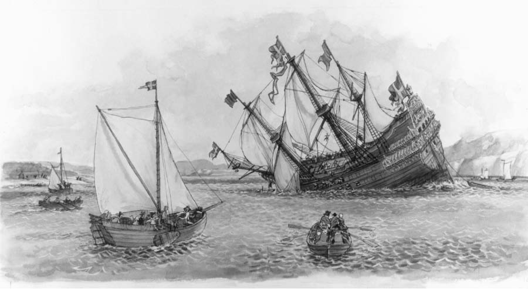

3.1 Architecture in a Technical Context
===

Architectures inhibit or enable the achievement of quality attributes, and one use
of an architecture is to support reasoning about the consequences of change in the
particular quality attributes important for a system at its inception.

**Architectures Inhibit or Enable the Achievement of Quality Attributes**

Chapter 2 listed thirteen reasons why software architecture is important and merits study. Several of those reasons deal with exigencies that go beyond the bounds of a particular development project (such as communication among stakeholders, many of whom may reside outside the project’s organization). Others deal with nontechnical aspects of a project (such as the architecture’s influence on a project’s team structure, or its contribution to accurate budget and schedule estimation). The first three reasons in that List of Thirteen deal specifically with an architecture’s technical impact on every system that uses it:

1. An architecture will inhibit or enable the achievement of a system’s quality attributes.
2. You can predict many aspects of a system’s qualities by studying its architecture.
3. An architecture makes it easier for you to reason about and manage change.

These are all about the architecture’s effect on a system’s quality attributes, although the first one states it the most explicitly. While all of the reasons enumerated in Chapter 2 are valid statements of the contribution of architecture, probably the most important reason that it warrants attention is its critical effect on quality attributes.

This is such a critical point that, with your indulgence, we’ll add a few more points to the bullet list that we gave in Section 2.1. Remember? The one that started like this:

* If your system requires high performance, then you need to pay attention to managing the time-based behavior of elements, their use of shared resources, and the frequency and volume of interelement communication. 

To that list, we’ll add the following:

* If you care about a system’s availability, you have to be concerned with how components take over for each other in the event of a failure, and how the system responds to a fault.
* If you care about usability, you have to be concerned about isolating the details of the user interface and those elements responsible for the user experience from the rest of the system, so that those things can be tailored and improved over time.
* If you care about the testability of your system, you have to be concerned about the testability of individual elements, which means making their state observable and controllable, plus understanding the emergent behavior of the elements working together.
* If you care about the safety of your system, you have to be concerned about the behavioral envelope of the elements and the emergent behavior of the elements working in concert.
* If you care about interoperability between your system and another, you have to be concerned about which elements are responsible for external interactions so that you can control those interactions.

These and other representations are all saying the same thing in different ways: If you care about this quality attribute, you have to be concerned with these decisions, all of which are thoroughly architectural in nature. An architecture inhibits or enables a system’s quality attributes. And conversely, nothing else influences an architecture more than the quality attribute requirements it must satisfy.

If you care about architecture for no other reason, you should care about it for this one. We feel so strongly about architecture’s importance with respect to achieving system quality attributes that all of Part II of this book is devoted to the topic.

Why is functionality missing from the preceding list? It is missing because the architecture mainly provides containers into which the architect places functionality. Functionality is not so much a driver for the architecture as it is a consequence of it. We return to this point in more detail in Part II.

**Architectures and the Technical Environment**

The technical environment that is current when an architecture is designed will influence that architecture. It might include standard industry practices or software engineering techniques prevalent in the architect’s professional community. It is a brave architect who, in today’s environment, does not at least consider a web-based, object-oriented, service-oriented, mobility-aware, cloud-based, social-networking-friendly design for an information system. It wasn’t always so, and it won’t be so ten years from now when another crop of technological trends has come to the fore.

>**The Swedish Ship Vasa**
>
> In the 1620s, Sweden and Poland were at war. The king of Sweden, Gustavus Adolphus, was determined to put a swift and favorable end to it and commissioned a new warship the likes of which had never been seen before. The Vasa, shown in Figure 3.1, was to be the world’s most formidable instrument of war: 70 meters long, able to carry 300 soldiers, and with an astonishing 64 heavy guns mounted on two gun decks. Seeking to add overwhelming firepower to his navy to strike a decisive blow, the king insisted on stretching the Vasa’s armaments to the limits. Her architect, Henrik Hybertsson, was a seasoned Dutch shipbuilder with an impeccable reputation, but the Vasa was beyond even his broad experience. Twogun-deck ships were rare, and none had been built of the Vasa’s size and armament.
>
> Like all architects of systems that push the envelope of experience, Hybertsson had to balance many concerns. Swift time to deployment was critical, but so were performance, functionality, safety, reliability, and cost.
>
> 
> # Figure 3.1 The warship. Used with permission of The Vasa Museum, Stockholm, Sweden.
>
> He was also responsible to a variety of stakeholders. In this case, the primary customer was the king, but Hybertsson also was responsible to the crew that would sail his creation. Also like all architects, Hybertsson brought his experience with him to the task. In this case, his experience told him to design the Vasa as though it were a single-gun-deck ship and then extrapolate, which was in accordance with the technical environment of the day. Faced with an impossible task, Hybertsson had the good sense to die about a year before the ship was finished.
>
> The project was completed to his specifications, however, and on Sunday morning, August 10, 1628, the mighty ship was ready. She set her sails, waddled out into Stockholm’s deep-water harbor, fired her guns in salute, and promptly rolled over. Water poured in through the open gun ports, and the Vasa plummeted. A few minutes later her first and only voyage ended 30 meters beneath the surface. Dozens among her 150-man crew drowned.
>
> Inquiries followed, which concluded that the ship was well built but “badly proportioned.” In other words, its architecture was flawed. Today we know that Hybertsson did a poor job of balancing all of the conflicting constraints levied on him. In particular, he did a poor job of risk management and a poor job of customer management (not that anyone could have fared better). He simply acquiesced in the face of impossible requirements.
>
> The story of the Vasa, although more than 375 years old, well illustrates the Architecture Influence Cycle: organization goals beget requirements, which beget an architecture, which begets a system. The architecture flows from the architect’s experience and the technical environment of the day. Hybertsson suffered from the fact that neither of those were up to the task before him.
> In this book, we provide three things that Hybertsson could have used:
> 1. Examples of successful architectural practices that work under demanding requirements, so as to help set the technical playing field of the day.
> 2. Methods to assess an architecture before any system is built from it, so as to mitigate the risks associated with launching unprecedented designs.
> 3. Techniques for incremental architecture-based development, so as to uncover design flaws before it is too late to correct them.
>
> Our goal is to give architects another way out of their design dilemmas than the one that befell the ill-fated Dutch ship designer. Death before deployment is not nearly so admired these days.
>
> —PCC